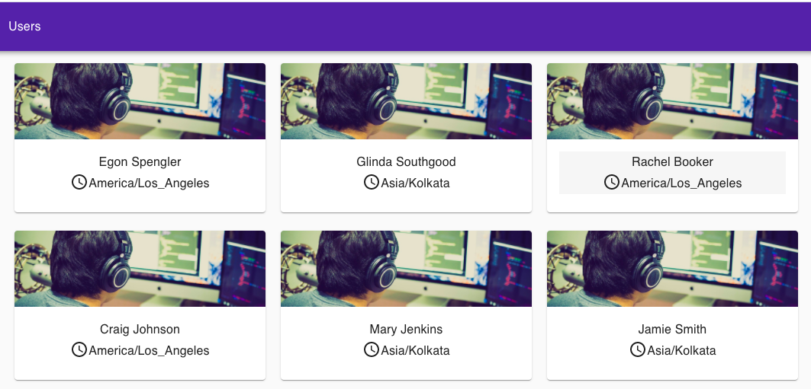
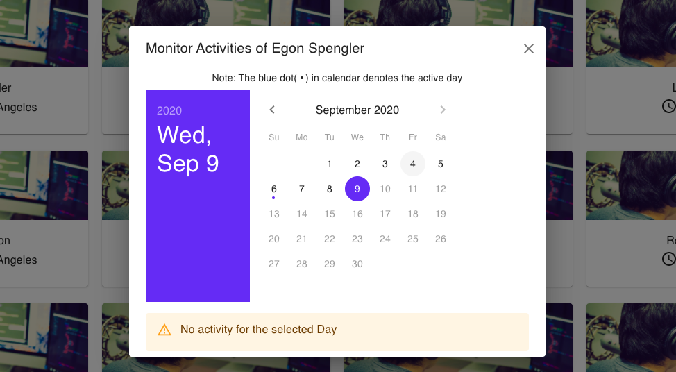
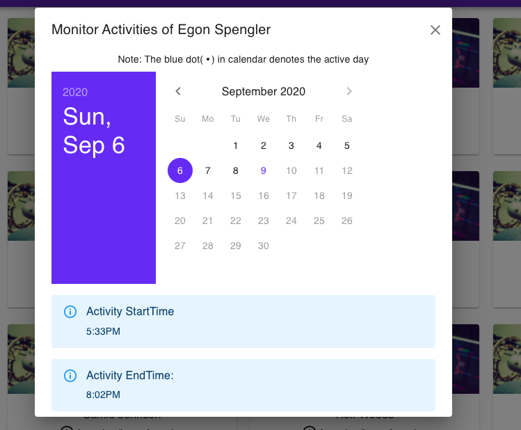

### Activity Monitor App

An Activity monitor App made using ReactJS which check the activity of the user at a particular day and time he started the activity and ended it.

## Link for the Application
 The application is hosted on the given link
 <a href = "https://evening-castle-90721.herokuapp.com/">
  <button style = "padding:7px">Demo Link of the App</button>
</a>

## Clone

`git@github.com:Biswajeet11/activityMonitor.git`

## Setup 

* After cloning the project `cd activityMonitor`
* Install the dependenies via `npm i`
* Run the application scrip `npm start`
* Application runs at <a href="\localhost:3000">`localhost:3000`</a>.

## WorkFlow of the Application

The end user is able to see list of users. When the user clicks on a particular user card modal pops up
with calendar where the user can see the details of the activities track.
The user can see the highlighted dates and time when the user is active using the `JSON` data for users. 

## Preview
Below are the Sceens preview

* User list screen show different users with name and time zone

* Modal shows calendar for user not active on a particular day

* Modal shows calendar for user not active on a particular day with their respective starttime and endtime of the day

